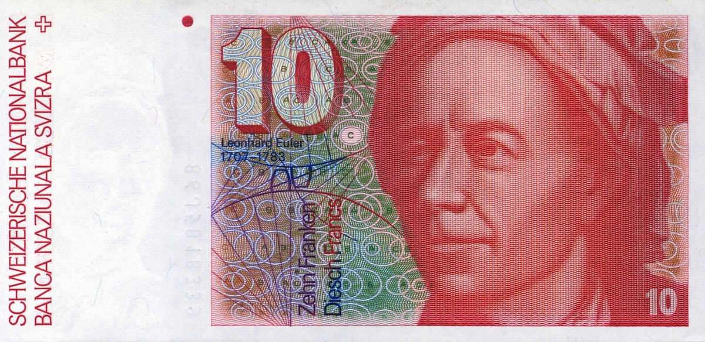

# Euler Project
[Link](http://projecteuler.net/) @makros

<table>
<th>#</th><th>Problem</th><th>Language</th><th>Files</th>

<tr><td>1</td><td>Multiples of 3 and 5</td><td>Ruby</td><td>euler1.rb</td></tr>

<tr><td>2</td><td>Even Fibonacci numbers</td><td>Ruby</td><td>euler2.rb</td></tr>

<tr><td>3</td><td>Largest prime factor</td><td>Ruby</td><td>euler3.rb</td></tr>

<tr><td>4</td><td>Largest palindrome product</td><td>Ruby</td><td>euler4.rb</td></tr>

<tr><td>5</td><td>Smallest multiple</td><td>Ruby</td><td>euler5.rb</td></tr>

<tr><td>6</td><td>Sum square difference</td><td>Ruby</td><td>euler6.rb</td></tr>

<tr><td>7</td><td>10001st prime</td><td>Ruby</td><td>euler7.rb</td></tr>

<tr><td>8</td><td>Largest product in a series</td><td>Ruby</td><td>euler8.rb</td></tr>

<tr><td>9</td><td>Special Pythagorean triplet</td><td>Ruby</td><td>euler9.rb</td></tr>

<tr><td>10</td><td>Summation of primes</td><td>Ruby</td><td>euler10.rb</td></tr>

<tr><td>11</td><td>Largest product in a grid</td><td>Ruby</td><td>euler11.rb, grid.rb</td></tr>

</tr>
</table>

